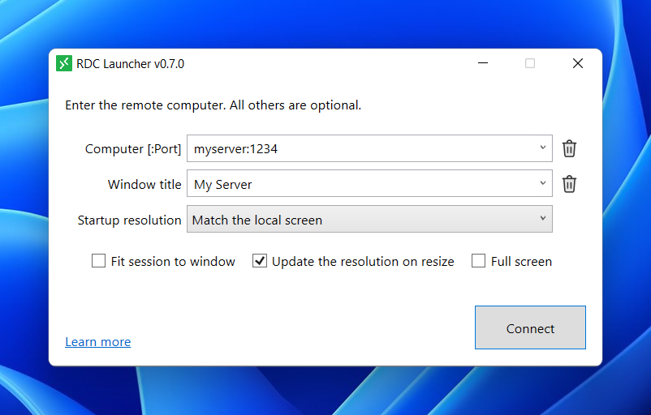
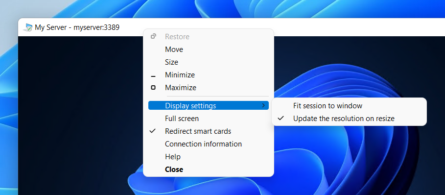

<br />

<p align="center"></p>

<h1 align="center">Remote Desktop Client Launcher</h1>
<p align="center">RDC Launcher allows to use the MSRDC as like the MSTSC.</p>

<br />
<hr>

> [!IMPORTANT]
> **RDC Launcher doesn't work with the latest MSRDC.**
> 
> Try <strong><a href="https://github.com/tksh164/alter-rdp-client">Alter</a></strong>✨ if you are looking for a similar remote desktop client. **Alter** has a similar feel and usability to the RDC Launcher and it doesn't depend on MSRDC.

<hr>
<br />

## 🗨 About

RDC Launcher allows to use the Remote Desktop client (msrdc) as like the Remote Desktop Connection (mstsc). You can leverage the benefit of the Remote Desktop client. e.g. Advanced display settings, window title naming.

<p align="center"></p>
<p align="center"></p>

## 📋 Prerequisites

- Windows 11 or Windows 10
- .NET Framework 4.7.2 or later
  - Windows 11 and Windows 10 have the .NET Framework 4.7.2 or later by default.
- Remote Desktop client (MSRDC)
  - You can download the Remote Desktop client installer from the [Microsoft's web page](https://docs.microsoft.com/en-us/windows-server/remote/remote-desktop-services/clients/windowsdesktop). Download it from the **Windows 64-bit** link if you use 64-bit Windows, also download it from the **Windows 32-bit** link if you use 32-bit Windows.

## 📥 Install

1. Download [an app's zip file](https://github.com/tksh164/rdclauncher/releases/latest).

2. After the download the zip file, you can unblock the zip file by check **Unblock** from the file's property or using [Unblock-File](https://docs.microsoft.com/en-us/powershell/module/microsoft.powershell.utility/unblock-file) cmdlet.
    
    ```powershell
    Unblock-File rdclauncher-x.y.z.zip
    ```
    
3. Extract to files from the zip file. You can extract files from the **Extract All...** context menu in the File Explorer or using [Expand-Archive](https://docs.microsoft.com/en-us/powershell/module/microsoft.powershell.archive/expand-archive) cmdlet.

    ```powershell
    Expand-Archive rdclauncher-x.y.z.zip
    ```

4. Locate to the extracted files to anywhere you like.

If you don't need this app anymore, you can uninstall it by delete the located folder.

## 💡 Tips

- RDC Launcher launch at the center of screen of the mouse cursor located on.
- You can change the default settings by edit the `rdclauncher.exe.config` that placed in the same place as the application's executable file (`rdclauncher.exe`).

  | Setting name | Value in the default settings file | Description |
  | ---- | ---- | ---- |
  | PortNumber | `3389` | The default port number for RDP connections when not specified the port number. |
  | DefaultFitSessionToWindowEnabled | `False` | If set `True`, the **Fit session to window** checkbox is checked by default. |
  | DefaultUpdateResolutionOnResizeEnabled | `True` | If set `True`, the **Update resolution on resize** checkbox is checked by default. |
  | DefaultFullScreenEnabled | `False` | If set `True`, the **Full screen** checkbox is checked by default. |

  ```xml
  <setting name="PortNumber" serializeAs="String">
      <value>3389</value>
  </setting>

  <setting name="DefaultFitSessionToWindowEnabled" serializeAs="String">
      <value>False</value>
  </setting>

  <setting name="DefaultUpdateResolutionOnResizeEnabled" serializeAs="String">
      <value>True</value>
  </setting>
  
  <setting name="DefaultFullScreenEnabled" serializeAs="String">
      <value>False</value>
  </setting>
  ```

- The history file located at `%LocalAppData%\rdclauncher\rdclauncher.exe_Url_<random-string>\<version>\user.config`. Delete this file if you want to delete the history.

## 🔨 Build from source

You can build the project using [Visual Studio 2022](https://visualstudio.microsoft.com/).

## ⚖ License

Copyright (c) 2021-present Takeshi Katano. All rights reserved. This software is released under the [MIT License](https://github.com/tksh164/rdclauncher/blob/master/LICENSE).

Disclaimer: The codes stored herein are my own personal codes and do not related my employer's any way.
