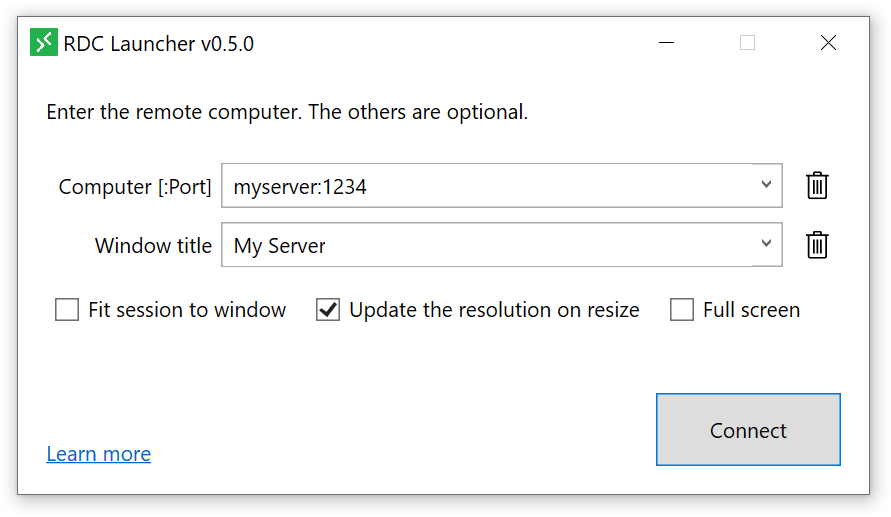
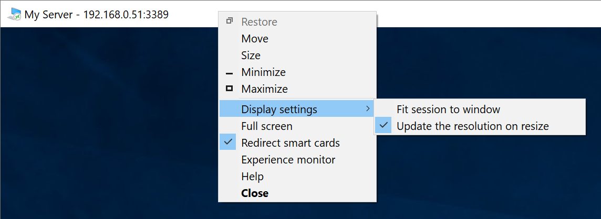

# RDC Launcher

The RDC Launcher allows to use the Remote Desktop client (msrdc) as like the Remote Desktop Connection (mstsc). You can leverage the benefit of the Remote Desktop client. e.g. Advanced display settings, window title naming.

## Prerequisites

- Windows 10
- .NET Framework 4.7.2 or 4.8
  - Windows 10 has the .NET Framework 4.7.2 by default.
- [Remote Desktop client](https://docs.microsoft.com/en-us/windows-server/remote/remote-desktop-services/clients/windowsdesktop)
  - You can download the Remote Desktop client installer from here.

## Install

1. Download [the zip file](https://github.com/tksh164/rdclauncher/releases/latest).
    - After the download the zip file, you can unblock the zip file from the file's property or using [Unblock-File](https://docs.microsoft.com/en-us/powershell/module/microsoft.powershell.utility/unblock-file) cmdlet.
2. Extract to files from the zip file. You can extract files from the `Extract All...` context menu in the File Explorer or using [Expand-Archive](https://docs.microsoft.com/en-us/powershell/module/microsoft.powershell.archive/expand-archive) cmdlet.
3. Locate to the extracted files to anywhere you like.

If you don't need this app anymore, you can uninstall it by delete the located folder.

## Notes

- You can change the default settings of this app by edit the `rdclauncher.exe.config` that placed in the same place as the application's executable file (`rdclauncher.exe`).
- The history file located at `%LocalAppData%\rdclauncher\rdclauncher.exe_Url_<random-string>\<version>\user.config`. Delete this file if you want to delete the history.

## Building from source

You can build the project using Visual Studio 2019.

## License

Copyright (c) 2021-present Takeshi Katano. All rights reserved. This software is released under the [MIT License](https://github.com/tksh164/rdclauncher/blob/master/LICENSE).

Disclaimer: The codes stored herein are my own personal codes and do not related my employer's any way.
